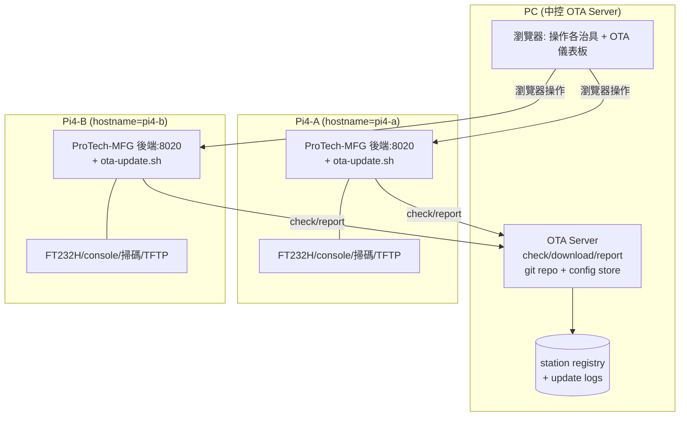

# ProTech-MFG — 多 Pi4 治具 + OTA 中控 ToDo

> 狀態：**規劃中（尚未執行）**。本檔僅記錄實作計畫，Task 1~7 皆未開始。
> 慣例：技術解釋用繁體中文；變數 / 函數 / 檔名 / 代碼保持英文。
> 來源：2026-09-17 規劃問答（PC 對多 Pi4 + OTA，仿 protech-nas-server-manager）。

---

## Problem Statement

將 ProTech-MFG（目前單機 FastAPI GUI）擴展為「1 台 PC 中控 + 多台 Pi4 治具」架構。每台 Pi4 各自跑完整後端（FT232H 電源控制 / ser2net console / USB 掃碼 / TFTP 全接該 Pi4），PC 除了操作各治具，還當 OTA 中控 server：集中管理程式碼版本與各台 config，透過 pull-based OTA（仿 protech-nas-server-manager 的 `ota-update.sh` 流程）遠端更新各 Pi4，含版本記錄與自動 rollback。station 以 hostname 識別，並寫入每筆 run 紀錄。

## Requirements（來自規劃問答確認）

- Pi4 當治具主機，後端 + 全部硬體接 Pi4；PC 純操作端（瀏覽器）。
- 1 PC 對多 Pi4；OS = Raspberry Pi OS 64-bit。
- station 名 = hostname（不寫死台數，新增機器免改腳本）。
- OTA = protech-nas-server-manager 模式（pull-based：check → download info → git checkout + pip install → health check → rollback → report）。
- 更新來源 = 自製 OTA endpoint（PC 中控 server 提供 check/download/report API）。
- 設定管理集中在 PC（各台 config 不同，OTA 時推對應該台版本；PC 維護 station→config 對應）。
- 版本 / rollback：保留上一版、health check 失敗自動切回。
- db 加 `station` 欄位，每筆 run 標記來源 Pi4。

## Background（研究發現）

- ProTech-MFG 後端已是 client-server（FastAPI，`host=0.0.0.0`），PC 用瀏覽器連 `http://<pi4>:8020` 即可操作，架構無需重寫。
- 硬體強耦合（`power_controller.py` FT232H、`console.py` serial/telnet、`manufacturing_script.py` TFTP、掃碼 usb_hid）必須實體接在跑後端的 Pi4。
- 現有 `db.py` 為本機 SQLite，`runs` 表無 station 欄位；`run_gui.py` 已用絕對路徑，可在任意 CWD 啟動。
- protech-nas-server-manager 提供可照搬的 OTA 範本：`deploy/scripts/ota-update.sh`（lock / backup / rollback / health / report）+ server 端 check/download/report 三 endpoint + Device/FirmwareVersion/UpdateLog 模型。
- 差異點：nas 用 PostgreSQL + asyncssh + Jinja2；ProTech-MFG 沿用輕量 SQLite + FastAPI static，不引入 PostgreSQL，避免過度設計。

## 架構圖

## Proposed Solution（高層）

先讓「單台 Pi4 可完整部署 + 開機自啟」落地（最小可 demo），再疊上 OTA 中控。分兩塊：
1. **Pi4 部署基礎**：install/systemd 腳本、station=hostname 注入、db 加 station 欄位、run 標記 station、arm64 依賴驗證。
2. **OTA 中控（仿 nas）**：PC 端 OTA server（check/download/report + config 推送）、Pi4 端 `ota-update.sh`（含 rollback/health/report）、PC 端 OTA 儀表板。

---

## Task Breakdown（皆未執行）

- [ ] **Task 1: station 識別 + db 綱要擴充（每筆 run 標記來源 Pi4）**
  - 目標：後端取得 station 名（預設 `socket.gethostname()`，可被 `MFG_STATION` 環境變數覆寫）；`runs` 表新增 `station TEXT`，`create_run` 寫入。
  - 實作：新增 `src/web/station.py`（`get_station()`）；`db.py` `init_db` 對舊 db 用 `ALTER TABLE ... ADD COLUMN station`（相容既有 db）；`create_run`、`list_runs`、`/api/runs/html` 帶出 station；GUI header 顯示目前 station。
  - 測試：pytest 驗證 `get_station()` 環境變數優先；舊 db 跑 `init_db` 後欄位存在且既有資料不遺失；`create_run` 後 `get_run` 回傳含 station。
  - Demo：GUI header 顯示 station 名；新建 run，`/api/runs/html` 顯示該筆 station。

- [ ] **Task 2: 單台 Pi4 部署腳本 + systemd 自啟（port 8020）**
  - 目標：一台 Pi4 一鍵安裝並開機自啟。
  - 實作：`deploy/install.sh`（建 venv、`pip install`、跑 `tools/setup_ft232h_gpio.sh`、產生 `VERSION`）；`deploy/protech-mfg.service`（`ExecStart=... python run_gui.py 8020`、`Environment=MFG_STATION=%H`、開機自啟、失敗自動重啟）；`deploy/README.md`。
  - 測試：`bash -n` 靜態檢查；PC 上 `py_compile`；`systemd-analyze verify`（若可用）。arm64 實機安裝 / `import mfg` / GUI 啟動由使用者在 Pi4 驗證。
  - Demo：Pi4 執行 `install.sh` + `systemctl enable --now protech-mfg`，重開機後瀏覽器連 `http://<pi4>:8020` 首頁可用，header 顯示該台 hostname。

- [ ] **Task 3: PC 端 OTA 中控 server 骨架 + station registry（仿 nas）**
  - 目標：PC 上獨立 OTA server（不與治具後端混用），提供 station 註冊與版本記錄。
  - 實作：新增 `ota_server/`（PC 專用，獨立 FastAPI + 獨立 SQLite）：`stations`（station/hostname、last_seen、current_version、current_git_hash、status）、`update_logs`（from/to version、status、error、time）；`GET /api/ota/stations`、`POST /api/ota/report`。沿用 sqlite3 + FileResponse，不引入 PostgreSQL。
  - 測試：pytest（TestClient）：report 未知 station 自動註冊；report completed 更新 current_version；stations 列表正確。
  - Demo：PC 啟 OTA server，`curl POST /api/ota/report`（模擬 Pi4）後 `GET /api/ota/stations` 看到該 station 與版本。

- [ ] **Task 4: OTA check / download 資訊 endpoint + 版本發佈（PC 端）**
  - 目標：PC 決定「最新版」，供 device 比對與取得更新指令。
  - 實作：OTA server 加 `POST /api/ota/check`（收 station + current_version/hash → 比對目標 git hash → 回 update_available + latest_version）、`GET /api/ota/download/{station}`（回 git branch/hash + 更新指令 + 該 station 的 config bundle URL/checksum）；PC 端維護「發佈版本」（ProTech-MFG git repo 目標 branch/hash + `VERSION`）與 `config store`（`ota_server/configs/<station>/`）。config bundle 打包 + sha256。
  - 測試：pytest：check 版本相同回 false、不同回 true + latest；download 回正確 git hash 與該 station config bundle URL；bundle checksum 正確。
  - Demo：`curl /api/ota/check`（舊 hash）回 true；`curl /api/ota/download/<station>` 回目標 hash + config bundle URL，下載該 URL 檔案 checksum 相符。

- [ ] **Task 5: Pi4 端 `ota-update.sh`（check → apply → health → rollback → report）**
  - 目標：把 nas 的 `ota-update.sh` 移植成 ProTech-MFG 版，跑在各 Pi4。
  - 實作：`deploy/ota-update.sh`：讀 `MFG_STATION`/`OTA_SERVER_URL`/`APP_DIR`；lock file 防併發；check → download → 備份目前 git hash → `git fetch + checkout TARGET_HASH` → `pip install` → 下載該 station config bundle（checksum 驗證後覆蓋 `config/`，覆蓋前備份）→ `sudo systemctl restart protech-mfg` → health check（`curl http://localhost:8020/api/health`）→ 失敗則 rollback（git checkout 舊 hash + 還原 config 備份 + restart）→ `POST /api/ota/report`。支援 `--check-only`。治具後端新增輕量 `GET /api/health`（回 `{"ok":true,"station":...}`）。
  - 測試：PC 上 `bash -n`；用 mock/本機 OTA server 跑 `--check-only` 驗證 check 流程與 JSON 解析。實機 apply/rollback 由使用者在 Pi4 驗證。
  - Demo：Pi4 手動跑 `bash deploy/ota-update.sh`：無更新輸出 up-to-date；PC 發佈新版後再跑，自動 git checkout + 重啟 + health 通過 + 回報 completed；故意讓新版啟動失敗，觀察自動 rollback 回舊版且 report=rolled_back。

- [ ] **Task 6: PC 端 OTA 儀表板（各 station 版本/狀態 + 觸發更新）**
  - 目標：PC 一個畫面看所有 Pi4 治具版本/狀態，並可觸發更新。
  - 實作：OTA server 加 `ota_server/static/index.html`（ProTech-MFG 深色風格 + htmx）：表格列 stations（hostname、current_version、status、last_seen、最近 update_log）。觸發更新：a) 顯示指令讓 Pi4 cron/手動跑 `ota-update.sh`（純 pull，預設）；b) 選配 `POST /api/ota/stations/{station}/trigger` 由 PC 經 SSH 遠端執行（需 PC→Pi4 SSH，預設關閉）。先做 a，b 標選配。
  - 測試：pytest：儀表板頁 200；stations/update_logs HTML fragment 正確。
  - Demo：PC 開 OTA 儀表板看到 Pi4 station 版本/狀態；觸發後該台完成更新，儀表板版本與 last_seen 更新。

- [ ] **Task 7: 文件與收尾（部署手冊 + kiro-memory 補記 + 多台複製流程）**
  - 目標：一份可照做的部署手冊，涵蓋新增第 N 台 Pi4。
  - 實作：`deploy/README.md`（PC OTA server 啟動、Pi4 install + systemd + cron 跑 `ota-update.sh` 排程、config store 放置規則 `ota_server/configs/<hostname>/`、arm64 依賴與 `setup_ft232h_gpio.sh`/ser2net 前置）；`docs/kiro-memory.md` 補「續 7」；requirements/gitignore 視需要更新（OTA server 獨立 db、config bundle 暫存不進 git）。
  - 測試：`py_compile` 全 py；OTA server pytest 全通過；`bash -n` 全腳本。
  - Demo：依 `deploy/README.md` 從零在一台新 Pi4 完成部署並被 PC 儀表板納管。

---

## 技術決策說明

- 沿用 ProTech-MFG 既有輕量技術棧（sqlite3 + FastAPI + FileResponse + htmx），OTA server 不引入 PostgreSQL/asyncssh，降低 Pi4 與 PC 的相依與維護成本。
- OTA 採 pull-based（device 主動）與 nas 一致：Pi4 只需能連到 PC 的 OTA server，PC 不必逐台維護連線；SSH 主動觸發列為選配。
- config 集中在 PC、依 hostname 分目錄推送，符合「各台設定不同」；程式碼走 git checkout（含 rollback），config 走 bundle + checksum。
- health check + 自動 rollback 保障產線治具更新失敗時能自我復原。

## 待確認（實作前）

- 是否納入 Task 6b 的 SSH 主動觸發（PC → Pi4）。
- config bundle 是否改用 git 管理（而非 tar + checksum）。
- `/api/health` 要驗到什麼程度（僅程序存活 vs 檢查硬體就緒）。
- Pi4 cron 更新頻率（例如每 10 分鐘 `--check-only`，或僅手動）。
